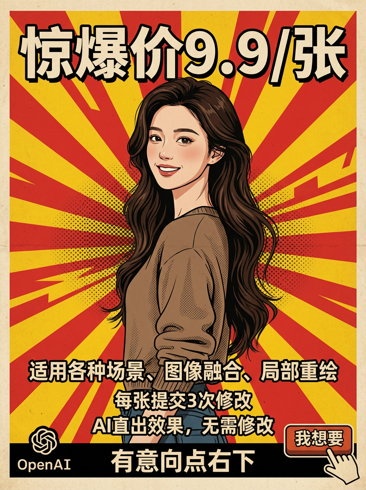

# 对比预览 - 3个样本案例

以下是3个样本案例的并排对比效果，请确认这个格式是否符合您的要求。

---

## 案例 3: 复古宣传海报

**作者**: @dotey

| GPT-4o | Google AI Studio |
|:------:|:----------------:|
|  |  |

提示词

复古宣传海报风格，突出中文文字，背景为红黄放射状图案。画面中心位置有一位美丽的年轻女性，以精致复古风格绘制，面带微笑，气质优雅，具有亲和力。主题是GPT最新AI绘画服务的广告促销，强调'惊爆价9.9/张'、'适用各种场景、图像融合、局部重绘'、'每张提交3次修改'、'AI直出效果，无需修改'，底部醒目标注'有意向点右下"我想要"'，右下角绘制一个手指点击按钮动作，左下角展示OpenAI标志。

---

## 案例 7: 个性化房间设计

**作者**: @ZHO_ZHO_ZHO

| GPT-4o | Google AI Studio |
|:------:|:----------------:|
|  |  |

提示词

为我生成我的房间设计（床、书架、沙发、绿植、电脑桌和电脑），墙上挂着绘画，窗外是城市夜景。可爱 3d 风格，c4d 渲染，轴测图。

---

## 案例 11: PS2 游戏封面 (GTA x Shrek)

**作者**: @dotey

| GPT-4o | Google AI Studio |
|:------:|:----------------:|
|  |  |

提示词

你能制作一个PS2游戏封面的图像吗？标题为《Grand Theft Auto: Far Far Away》。是一个设定在《怪物史瑞克》宇宙中的GTA风格游戏。

---

## 确认事项

1. **表格布局**: 左边GPT-4o，右边Google AI Studio
2. **图片大小**: 自动缩放适应
3. **提示词**: 折叠显示，点击展开

如果您对这个格式满意，我将按此格式更新全部100个案例到 README.md 中。
